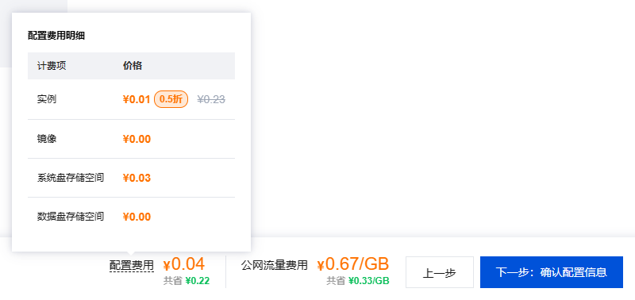
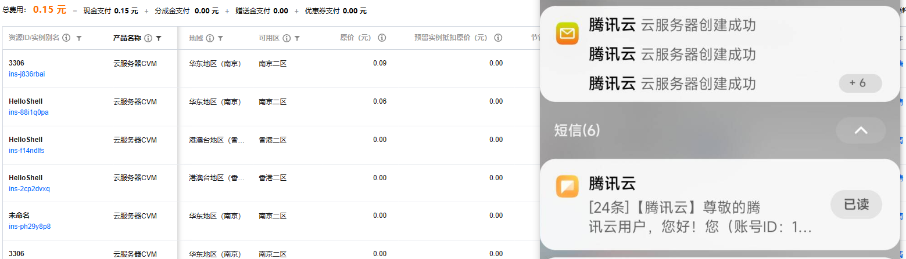

# 腾讯云抢占式实例监听器

欢迎关注关联主项目：[Hello_CTF](https://github.com/ProbiusOfficial/Hello-CTF)

如果你在寻找一个纯免费的方案，推荐另一个项目[frp-R3shell](https://github.com/ProbiusOfficial/frp-R3shell)


## 引言

你是否面临下面这些问题？

"做题时，发现题目需要反弹shell，但是没有服务器！！"

又或者是，不在之前，不在之后，就恰巧这个时候——"我敲，哥们服务器怎么过期了！！！"

亦或者，服务器买来就只是为了弹个shell，但是却被大数据杀熟 —— 一台服务器，一年几百块，放着还生灰！？？
.....
这些都不是问题，反弹shell的廉价解决方案，它来了！！！

每个小时成本低至几分钱，随用随销毁，了事拂衣去,深藏功与名！！！

## 前提

- 拥有一个腾讯云账号，并且完成实名认证，没有？快用我的链接注册呜呜呜：[点我注册](https://curl.qcloud.com/7YFqnsuM)  

- 在腾讯云上存留账户余额，建议5-10元，然后就能一直用下去！！(这也是使用腾讯云的原因，隔壁阿里的抢占实例虽然便宜几分但是需要预存120元以上余额，我的评价是**)

- 在访问控制中获取你的 SecretID 和 SecretKey，[点我获取](https://console.cloud.tencent.com/cam/capi),注意一定要妥善保管，不要泄露给他人！！！建议使用子账号密钥，仅分配私有网络和云服务器的权限，以防被人恶意使用！！！

- ~~确保在对应地区 有一个 **端口全开放** 的安全组~~ （12.3更新 如果没有对应安全组 则会自行创建安全组）

- 为了更好的体验 请在云端配置公私钥实现免密登录！！！  

## 使用方法

- clone 本项目到本地

```bash
git clone https://github.com/ProbiusOfficial/Hello_CTF-Shell.git
```

- 在目录中创建一个名为 `cred` 的文件，将你的 SecretID 和 SecretKey 写入，格式如下：

```json
{ 
    "SecretId": "",
    "SecretKey": "",
    "Password":"r00t@HelloShell",
    "Description": "Password 是实例主机启动密码，需要包含大小写字母、数字和特殊字符，长度8-30位。默认为 r00t@HelloShell , 建议修改，推荐配置公私钥实现免密登录"
}
```

- 安装依赖

```bash
pip install -r requirements.txt
```

- 运行

```bash
python main.py
```


## 成本计算

目前机器的配置和计费如下：

选取优惠区域 **南京** 和 **香港**

- module_1: 南京模块,配置信息为2核心2G内存,20G系统盘,10M带宽,镜像为Ubuntu Server 22.04 LTS 64位(ID:img-487zeit5),   
  资费信息: 实例 ¥0.05 系统盘存储空间 ¥0.02 公网带宽按流量计费¥0.80/GB(内地) 每小时结算 平均资费 **-¥0.08/小时**  

- module_2: 香港模块,配置信息为2核心2G内存,20G系统盘,10M带宽,镜像为Ubuntu Server 22.04 LTS 64位(ID:img-487zeit5),   
  资费信息: 实例¥0.01 系统盘存储空间¥0.03 公网带宽按流量计费¥0.67/GB(香港) 每小时结算 平均资费- **¥0.04/小时**





**这几天写轮子弹来弹去一共只花了0.15！**

**什么叫物美价廉！！！**

## 自定义？
- 修改 hello_shell.json 中的配置信息，包括地域、镜像等内容，相关注释已经写在 hello_shell_template.json 文件中
- 其他参数问题请查阅 腾讯云API [帮助文档](https://cloud.tencent.com/document/api)，或访问[API Explorer](https://console.cloud.tencent.com/api/explorer)

## TODO
- 等您的issue！！
- 优化交互逻辑
- 定制化镜像环境以直接支持log4j漏洞利用？
- 更多功能！！
